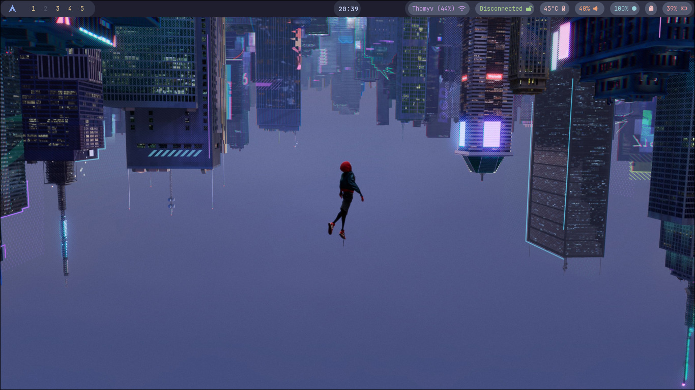
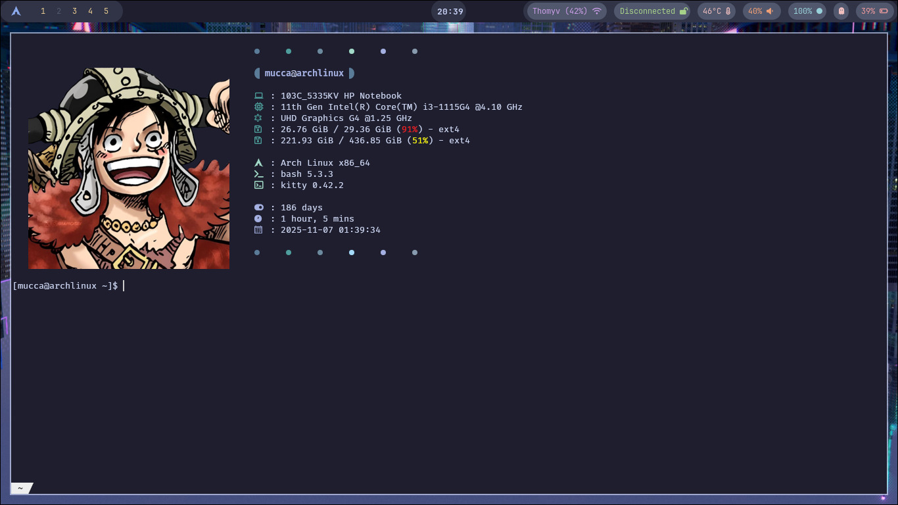
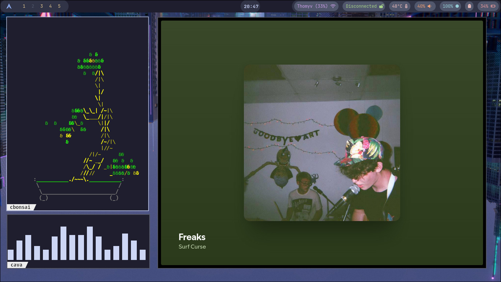

# 🌌 HyprBlue

*A custom Arch Linux rice built with Hyprland, inspired by Luffy and Spiderman — a blue-themed setup focused on performance, minimalism, and aesthetics.*

---

### 🖼️ Screenshots

| Desktop | Terminal | Waybar |
|----------|-----------|--------|
|  |  |  |

---

## 🧩 Features

- ⚙️ **Window Manager:** Hyprland (Wayland compositor)
- 🧭 **Status Bar:** Waybar with custom modules
- 💻 **Terminal:** Kitty with Luffy background image
- 🌆 **Wallpaper:** Spiderman-inspired blue theme
- 🎨 **Color Scheme:** Shades of blue and red with high contrast
- 🪶 **Fonts:** JetBrains Mono / FiraCode Nerd Font
- 🧾 **Configs:** All dotfiles included and organized in `.config/`
